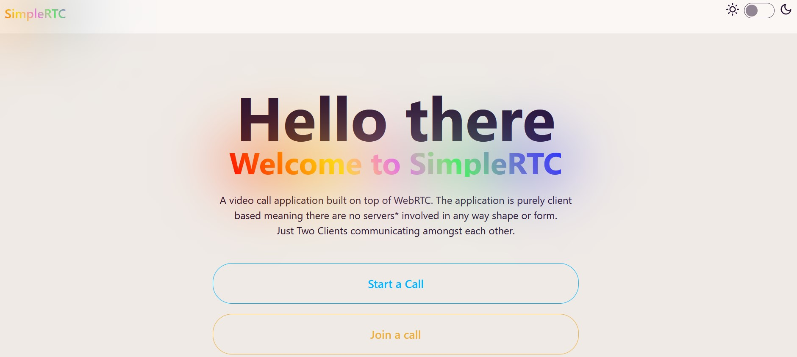
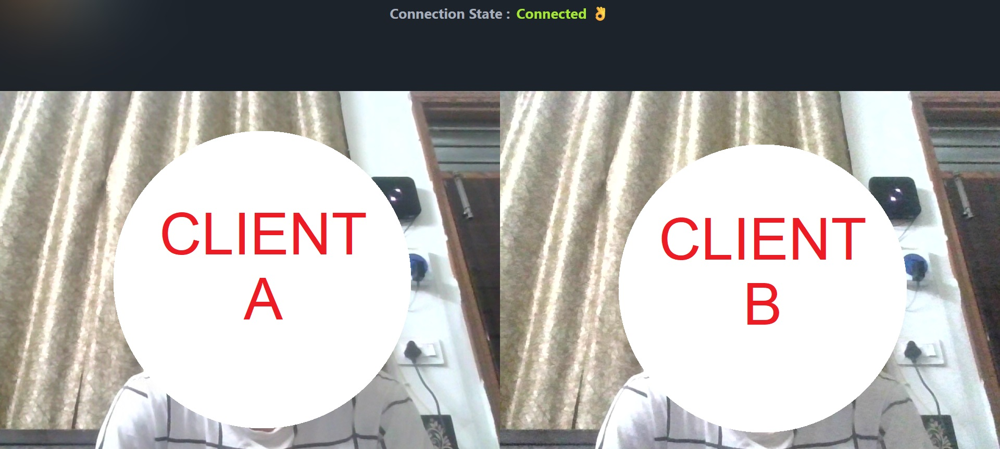

# SimpleRTC Video Call App 📹

SimpleRTC is a WebRTC-based video call app built using React and Vite.

## Overview

SimpleRTC is an entirely client-based video call application, meaning it doesn't rely on any servers for communication. 
---

Users can initiate video calls by following a simple process where the host generates an offer, shares it with the peer, and then the peer generates an answer for host to start the call.

### Note 📝

Since SimpleRTC is created for learning purposes and not intended for production, it doesn't integrate dedicated servers like Node.js, socket server, or cloud services like Firebase to streamline the call initiation process.

## Screenshots 📸

*Home Page*

*Call Page*

## Demo 🌐

Check out the live demo of SimpleRTC [here](https://simplertc.onrender.com).

## License 📄

This project is licensed under the MIT License - see the [LICENSE](LICENSE) file for details.

